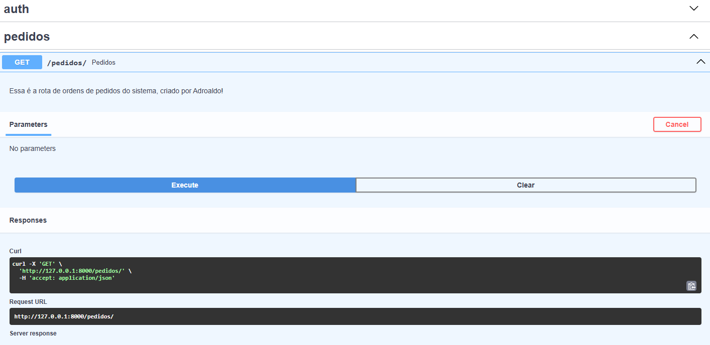
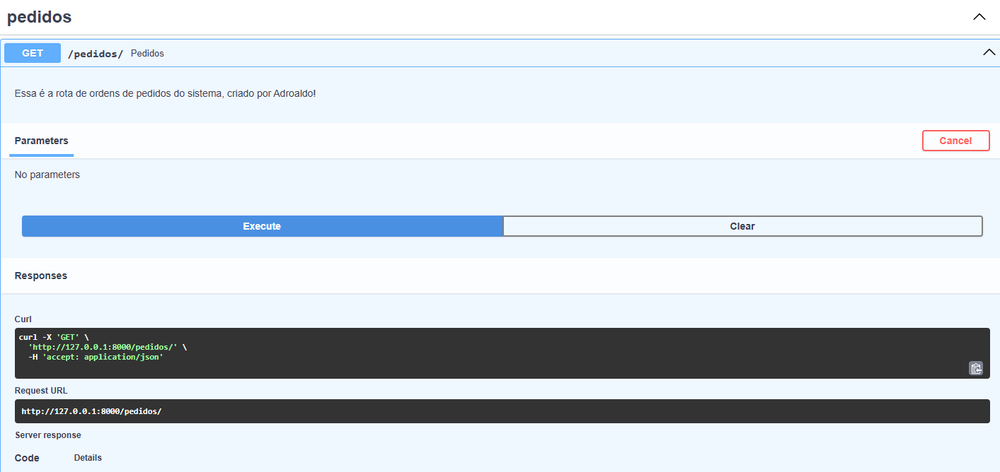

# Data_migration

Repositório para projetos de migração de dados.

Edições

<!-- com a mudança do diretório Data_migration(rename) houve a necessidade de alterar a pasta de inicialização do git
comando:
git remote set-url origin https://github.com/DSadroaldo/Data_migration.git // > montando nova URL
(https://github.com/DSadroaldo/Data_migration.git*https://github.com/DSadroaldo/Data_migration.githttps://github.com/DSadroaldo/Data_migration.git)

-->
<!--  -->

<!-- criacao da conta do usuario
  como estruturar o processo de crição de itens no seu banco de dados
  garantir sessoes no banco de dados maneira robusta e escalavel
  atender a fechar sessoes, sem deixa-las abertas
  A base do processo de criação rotas, endpoints, links-->

<!--
  # sqlalchemy, ORM(obj) - > permite que você interaja com o seu banco de dados usando objetos Python em vez de escrever comandos SQL diretamente. Ele "mapeia" as classes Python para tabelas do banco de dados e os objetos (instâncias dessas classes) para as linhas dessas tabelas. -->

<!-- Sessions Restrições
 e importante gerenciar as sessoes de conexões no banco de dados
  isto é, torna-se impreenscídivel a finalização das conexões abertas no banco de dados
  CRIAR | FAZER o q TEM FAZER | FECHAR -->

  <!-- Criamos primeiro escopo de rota de criação e autenticação de usuário
  sem nos atermos a regras mais seguras. Aqui nos atemos a gerar a teste de rota e create de um item 
  a nível de teste  -->
